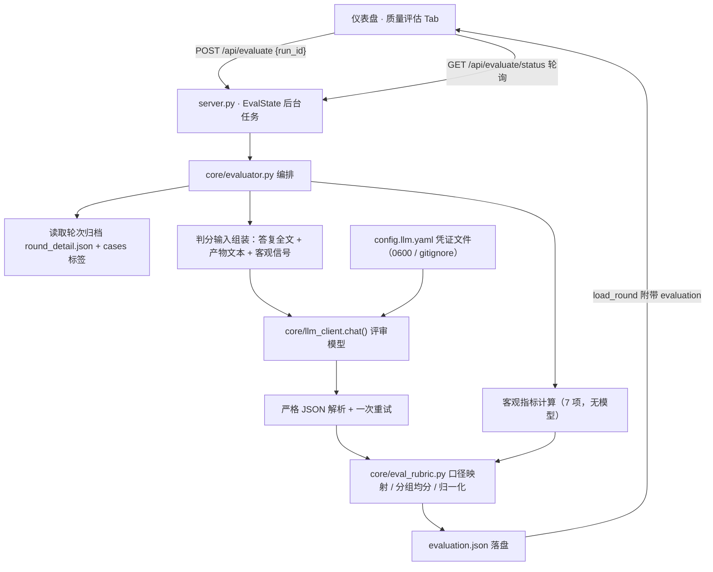

## 产品概述
为「睿云智能工作台 · UI 测试平台」新增 **Metric Evaluation（质量评估）** 能力：在仪表盘上对选中的测试轮次按需触发评估，由用户配置的大模型作为评审员，结合日志中的客观信号，产出 20 项指标评分与可视化结果。核心目标是回答「这个 Agent 干得好不好」，而不只是「有没有崩」。

## 核心功能

- **评估入口**：仪表盘轮次详情新增「质量评估」Tab，按需对当前轮次触发评分，支持进度显示与重新评估。
- **分组评分**：按用例类型自动分流——教学问题评「教学专业质量」（教学专业性、教学适配度、课堂可用性、拓展性/启发性），非教学问题评「结果质量」（正确性、完整性、相关性、实操性、启发性）；「安全与可靠」（美观度、安全性、稳定性、格式遵循度）与「系统与 Agent 能力」（Tool 选择正确率、Skills 选择正确率、执行成功率、自纠正成功率、任务完成率、交付效率、成本控制）对两类都评。
- **评分依据**：最终答复全文 + 产出物文本 + 客观信号（工具调用、失败、轮次、耗时、Token）。客观类指标优先用日志直接计算，主观类交给模型按锚点评分。
- **评分锚点**：20 项全部按给定分档口径评分（安全性为 0/3/5，执行成功率与任务完成率为 5/0，其余为 1–5；比例型按 ≥95%/85–94%/70–84%/50–69%/<50% 映射）。
- **可视化**：分组均分、归一化综合分、逐用例得分表、逐维度评分理由、Token 成本记录；不适用的维度（如单轮无法评估的稳定性、无产物时的美观度）明示为「不适用」，不伪造分数。

## 视觉与交互
沿用既有浅色仪表盘视觉体系，新增 Tab 与原有「用例详情 / 客观信息 / 问题发现」保持一致的卡片、表格、色块与交互规范；未评估时展示触发入口，评估中展示进度，评估后展示分组均分卡片、逐用例得分表与可展开的维度理由。


## 技术栈
- 后端：Python 3，**仅标准库**（`urllib.request` / `json` / `concurrent.futures` / `threading`），复用本会话已建的 `core/llm_client.py` HTTP 管道，**不新增第三方依赖**（`requirements.txt` 不变）。
- 前端：`web/index.html` 单文件，原生 JS + 既有 CSS 变量与组件样式，**不引入图表库、不新增视觉体系**。
- 存储：评估结果写入轮次归档 `artifacts/rounds/<run_id>/evaluation.json`；模型凭证由「浏览器 localStorage」迁移为「服务端独立密钥文件」（依据用户明确选择）。

## 实现方案

### 总体策略
按「口径数据 / 判定内核 / 传输服务 / 交互呈现」四层拆分，最大化复用既有架构：

1. **`core/eval_rubric.py`（新增）**：把 20 项指标的**分档锚点写成结构化的纯数据**（key、中文名、所属分组、分值档、是否适用、锚点原文），并提供「比例→分」「教学分组判定」「归一化/分组均分」纯函数。把口径抽成数据层，是为了让所有评分入口共用同一份标准，避免口径散落在 prompt 字符串里。
2. **`core/evaluator.py`（新增）**：判定内核——组装判分输入、计算客观指标、调用评审模型、解析容错、并发编排、聚合落盘。延续仓库「纯逻辑独立成 core 模块」的惯例（如 `core/repro.py`）。
3. **`server.py`（改造）**：只做「后台任务 + REST + 脱敏」，复用 `RunState` 已确立的「子进程/线程 + 状态轮询 + 日志回放」范式，改为 `EvalState` 线程任务。
4. **`web/index.html`（改造）**：新增第 4 个 Tab 与模型配置的服务端读写。

### 关键技术与决策

**① 一次用例只调一次模型**
把该用例**全部适用维度**打包成一次 `chat` 调用，要求严格 JSON 返回（分数 + 理由 + 置信度）。避免 20×N 次调用造成成本失控。解析做容错：剥离 ```json 围栏 → `json.loads` → 失败则带「修复指令」重试 1 次；仍失败则记 `judge_failed` 并降级（该用例仅保留客观维度分）。

**② 客观维度不交给模型**
7 项系统能力中，能算的绝不问模型：

| 指标 | 客观口径 |
|---|---|
| 执行成功率 | 命中 `TOOL_CALL_FAILED`/`TOOL_RESULT_MISSING` → 0；否则 5 |
| 自纠正成功率 | 失败调用之后同一工具是否换参成功；无失败视为 100% → 5；否则按 ≥80%/≥60%/≥40%/<40% 映射 4/3/2/1 |
| 任务完成率 | 有最终答复，且（用例声明产物目标或轨迹出现产物类工具）确有产物 → 5；否则 0 |
| 交付效率 | `turn_count` 与 `elapsed_s` 取较优档：≤2 轮或 <5min→5；≤3 轮或 <10min→4；≤4 轮→3；多轮且有答复→2；无答复→1 |
| Tool 选择正确率 | 用例声明 `expected_tools` 时按覆盖率映射比例档；未声明则由模型给出比例 + 理由 |
| Skills 选择正确率 | 轨迹无 `read_skill_file` → 不适用；否则由模型依据技能清单与产出关系给出比例 |
| 成本控制 | 只记录输入/输出 Token，不评分、不计入综合分 |

**③ 教学 / 非教学分流与降级**
`labels.scene ∈ {备课, 作业批改, 家校沟通, 教育-其他}` → 教学组（4 项）；其余 → 非教学组（5 项）。**手工输入的用例没有 labels**，此时标记为「未分类」并**默认走非教学组且在界面显式标注**，不静默归组、不双重计分。

**④ 判分输入组装（不解析二进制）**
产出物文本**优先从工具调用结果抽取**（`mcp_write_workspace_file.file_content`、`convert_markdown_to_docx.markdown_content`、写 HTML/表格类工具的结果等），**不尝试解析 docx/pptx/xlsx 二进制**。抽不到产物文本时，`美观度`、`课堂可用性` 标记为**不适用**并计入均值分母之外。同时对超长文本设上限（答复 20000 字、单产物 8000 字），命中上限时在结果里记录「已截断」，保证评分依据可追溯。

**⑤ 稳定性不伪造**
单轮内每条用例只运行一次，无法评估「多次结果一致性」。默认标记为**不适用**并在界面注明「需重复运行」；若通过扫描 `artifacts/rounds/*/cases.yaml` 发现同一 prompt 存在历史**已评估**轮次，则按两次综合分之差映射分档，否则保持不适用。

**⑥ 归一化与展示口径**
分档不统一（安全性 0/3/5、执行/任务 5/0、其余 1–5），故：展示用**原始分**，综合分用**归一化均值（÷5）**，且排除不适用维度与成本控制；口径在界面显式标注。

**⑦ 后台执行与可中断**
`EvalState` 线程 + 线程池（默认并发 3，可配），逐用例落进度（done/total/failed），单用例异常不影响整轮；支持中途取消；完成后原子写 `evaluation.json`。评估任务与测试任务互斥（同一时刻只允许一个评估），避免互相干扰。

**⑧ 凭证落盘的安全处理（用户已明确改变此前的「不落盘」决定）**
新增独立密钥文件 `config.llm.yaml`，并配套：新建 `.gitignore` 忽略该文件、写入时 `chmod 0600`、读取接口返回**脱敏后的 Key**（复用 `core/llm_client.redact()`）、日志与响应绝不回显原文。模型配置由 localStorage 迁移为服务端文件作为**唯一事实源**，避免双写漂移。

### 性能与成本
- 单用例 = 1 次模型调用（含 1 次重试上限），并发 3；N 条用例的墙钟时间 ≈ ⌈N/3⌉ × 单次延迟。
- 判分输入超长文本截断上限，防止单次调用 Token 爆炸；评估侧 Token 用量与耗时一并记入 `evaluation.json` 供成本核算。
- 评估为**按需触发**（用户明确选择），不随流水线自动执行，避免每轮无条件消耗 Token。

## 实现要点（执行细节，防回归）

- **`core/llm_client.py` 复用而非重写**：沿用 `_do_request` / `_NoRedirect` / `classify_exception` / `redact`；新增 `chat()` 返回 `(content, usage, error)`，并复用既有 `normalize_base_url` / `prefix_candidates` 做地址容错。**不得**把系统代理排除逻辑（`ProxyHandler({})`）误用到外网调用上。
- **口径固化**：20 项锚点原文必须逐字落入 `core/eval_rubric.py`，不得改写；`安全性`（0/3/5）与 `执行成功率`/`任务完成率`（5/0）的特殊分档要在数据结构里显式声明，避免被通用 1–5 逻辑覆盖。
- **接口契约不破坏**：`load_round()` 只**新增** `evaluation` 字段，不改动既有 `summary` / `detail` 结构与 `/api/rounds` 返回；轮次归档新增文件而不改动既有文件语义。
- **同源守卫**：新增 `POST` 路由必须走既有 `_same_origin_ok()`，失败返回 JSON（与既有 403 行为一致）。
- **前端一致性**：Tab 与按钮沿用 `.tab` / `.btn-ghost` / `.btn-primary` / `.card` / `table` / `.badge` / `.track`，不新增配色与字体；用户已要求精简说明文案，新增 UI **不再堆提示文字**，仅在必要处标注口径与「不适用」。
- **迁移完整性**：模型配置由 localStorage 改为服务端文件后，需保证 `grep` 无新旧混用残留；首次打开弹窗时若检测到 localStorage 旧值且服务端为空，提示一次性导入后清除，避免两份数据并存。
- **失败降级**：模型不可用（未配置 / 401 / 403 / 超时）时，评估整体返回可读错误且**不写入半成品**；单用例判分失败只影响该用例。

## 架构设计



数据流：仪表盘发起 → 服务端后台任务 → 逐用例组装输入 → 评审模型返回 JSON → 口径映射与聚合 → 写入 `evaluation.json` → 前端渲染分组均分与逐用例明细；全程凭证不回显、日志不落 Key。

## 目录结构

```
ruiyun-ui-test-platform/
├── core/
│   ├── eval_rubric.py        # [NEW] 评估口径数据层：20 项指标定义（key/中文名/分组/
│   │                         #       分值档/是否适用/锚点原文逐字）、比例→分映射（≥95%→5、
│   │                         #       85–94%→4、70–84%→3、50–69%→2、<50%→1）、
│   │                         #       教学场景判定、归一化与分组均分。纯数据+纯函数，无 IO。
│   ├── evaluator.py          # [NEW] 判定内核：组装判分输入（prompt/是否教学/答复全文/
│   │                         #       产物文本/客观信号）、计算 7 项客观指标、调用评审模型、
│   │                         #       严格 JSON 解析与一次重试、线程池并发 3、稳定性探测、
│   │                         #       聚合与 evaluation.json 落盘。单用例失败不影响整轮。
│   └── llm_client.py         # [MODIFY] 新增 chat()（OpenAI 兼容 /chat/completions，返回
│                             #       content + usage），新增 load_llm_config()/
│                             #       save_llm_config()（独立密钥文件，0600 权限），
│                             #       复用既有 _do_request/_NoRedirect/redact。
├── scripts/
│   └── test_evaluator.py     # [NEW] 注入式自测 + 本地假供应商端到端：口径映射边界、
│                             #       教学分组、特殊分档（0/3/5 与 5/0）、JSON 容错与重试、
│                             #       客观指标口径、脱敏不回显、不适用维度不计入均值。
│                             #       沿用纯 assert + __main__ 风格（仓库无 pytest）。
├── server.py                 # [MODIFY] 新增 GET/POST /api/llm/config（Key 脱敏返回）、
│                             #       POST /api/evaluate、GET /api/evaluate/status；
│                             #       EvalState 后台任务（进度/取消/互斥）；load_round() 附带
│                             #       evaluation 字段；所有 POST 走 _same_origin_ok()。
├── web/
│   └── index.html            # [MODIFY] renderRound() 新增第 4 个 Tab「质量评估」；
│                             #       setTab 增加 eval 分支 + evalTab() 渲染（分组均分卡片、
│                             #       归一化综合分、逐用例得分表、可展开维度理由、成本记录、
│                             #       不适用标注、触发/进度/重跑）；模型设置弹窗改为读写
│                             #       服务端配置并完成 localStorage 一次性迁移。
├── config.yaml               # [MODIFY] 新增 llm 段：config_file、eval.max_workers/timeout_s、
│                             #       max_answer_chars/max_artifact_chars、teaching_scenes。
├── .gitignore                # [NEW] 忽略 config.llm.yaml（密钥）、__pycache__/、*.pyc、
│                             #       .venv/、.DS_Store、logs/；不忽略 artifacts。
└── config.llm.yaml           # [NEW] 服务端模型凭证（base_url/api_key/model），0600 权限，
                              #       由 /api/llm/config 读写；仓库中不提交。
```

## 关键代码结构

```python
# core/eval_rubric.py —— 口径契约（仅接口）

@dataclass(frozen=True)
class Dimension:
    key: str            # 稳定标识，如 "correctness"
    name: str           # 中文名，如 "正确性"
    group: str          # result / teaching / safety / agent
    scale: tuple        # 允许分值，如 (5, 4, 3, 2, 1) 或 (5, 3, 0) 或 (5, 0)
    anchor: str         # 锚点原文（逐字，来自需求，不得改写）
    llm: bool           # True=需模型判分；False=客观计算
    na_when_no_artifact: bool = False   # 无产物文本时判为「不适用」

def ratio_to_score(rate: float) -> int: ...      # 比例档映射
def is_teaching(scene: str | None) -> bool: ...  # 教学分组判定
def normalize(score: int) -> float: ...          # score / 5
```

```json
// artifacts/rounds/<run_id>/evaluation.json —— 落盘契约（仅结构）
{
  "run_id": "run_20260917_101530",
  "generated_at": "2026-09-17 10:20:00",
  "rubric_version": "1.0",
  "objective": { "total": 6, "scored": 5, "na": 1, "judge_failed": 0,
                 "judge_tokens": { "input": 0, "output": 0 },
                 "elapsed_s": 0 },
  "cases": [{
    "case_id": "CASE-001", "is_teaching": true, "scene": "备课",
    "group_scores": { "teaching": 4.25, "safety": 5.0, "agent": 4.4 },
    "composite": 0.87,
    "dimensions": { "教学专业性": { "score": 4, "reason": "…", "source": "llm" },
                    "稳定性": { "score": null, "na": true, "reason": "单轮仅运行一次，需重复运行" },
                    "成本控制": { "score": null, "cost_only": true, "tokens": { "input": 0, "output": 0 } } }
  }],
  "round": { "group_means": { "result": 4.1, "teaching": 4.25, "safety": 5.0, "agent": 4.4 },
             "composite": 0.87, "cost": { "input_tokens": 0, "output_tokens": 0 } }
}
```


## 应用类型与设计定位
桌面端 Web 仪表盘（存量系统增量）。新增「质量评估」Tab，**不改变现有页面布局与配色**，严格沿用既有设计体系，避免引入第二套视觉语言。

## 设计风格
延续既有浅色仪表盘：白底卡片 + 细边框 + 品牌蓝强调色，信息密度高、以表格与数值为主。风格关键词：克制、数据优先、可核对。

## 页面区块规划（质量评估 Tab，自上而下）
- **评估控制条**：左侧显示本轮评估状态（未评估 / 评估中 / 已完成 + 时间）；右侧「开始评估 / 重新评估」按钮；评估中显示 done/total 进度与「取消」。
- **分组均分卡片**：四张等宽卡片——结果质量、教学专业质量、安全与可靠、系统与 Agent 能力，展示分组均分（归一化后）与适用维度数；下方一行显示归一化综合分与 Token 成本。
- **逐用例得分表**：列为 用例、类型（教学 / 非教学 / 未分类）、各维度得分、综合分；得分用既有 `.badge` 按分档着色（5 绿 / 4 蓝 / 3 灰 / 2 橙 / 1 红 / 不适用 中性灰）；点击行展开该用例的维度理由与依据来源。
- **口径说明区**：折叠展示分组规则、归一化口径、不适用维度的判定原因（稳定性、无产物时的美观度与课堂可用性），保证分数可核对。

## 响应式
沿用现有 `max-width:960px` 断点：窄屏下分组卡片改为两列、得分表横向可滚动，控制条按钮换行右对齐。

## Agent Extensions
### Skill
- **编程专家.Skill**
  - Purpose: 作为本次大任务的工程纪律约束，贯穿「分析 → 方案 → 执行 → 验证 → 交付 → 复盘」六步闭环。
  - Expected outcome: 每个 Wave 均产出可核对证据（自测通过数、端到端状态码与响应、脱敏校验结果），不跳过验证与复盘，失败项如实列入已知限制。

### SubAgent
- **code-explorer**
  - Purpose: 实施前对三处跨文件链路做一次影响面扫描——轮次归档结构（`round_detail.json` / `cases.yaml` / `evaluation.json` 的读写方）、前端 Tab 渲染链路（`renderRound` → `setTab` → `tabBody`）、密钥读取路径（`config.yaml` → `llm_client` → `server` → 前端）。
  - Expected outcome: 输出「文件:行号 + 原文」形式的引用清单，确认无遗漏调用方与无新旧配置混用点，作为改造前的影响面基线。
