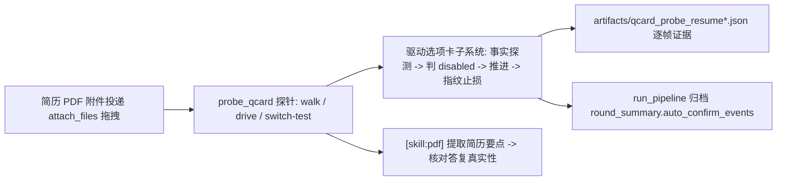

## 产品概述

用用户的个人简历作为附件，在真实应用里触发 agent 的选项卡（`agent-question-composer`），在**新素材**上复验上一轮已落地的选项卡自动点击修复是否成立，而不是只在考勤制度 PDF 上验证过。

## 核心功能

- **换素材触发卡片**：附件改用 `/Users/amano/Downloads/翟嘉乐-个人简历.pdf`，提示词带「需求不明确请先提问」的语义，让 agent 主动弹卡；同一素材可多次尝试（卡片是否出现由 LLM 决定，存在随机性）。
- **卡片结构走查**：逐题点「下一题」只读导出真实结构——题号 `x/y`、题目、每个选项的文本/是否已选（`is-selected`）/是否禁用、底部按钮到底是「提交 / 确认」还是「跳过」。
- **自动推进复验**：改用修复后的驱动推进卡片，观察题号是否单调前进（`1/N → … → N/N → 提交`）、有无回退重置、事件里有无假点击，最终任务是否落到真实答复。
- **内容真实性核对**：答复内容必须能对上简历本身的信息（否则属卡在提问上的假通过）。
- **新形态补齐**：若简历场景暴露出此前未覆盖的卡片形态（如纯自由输入题、多选题、提交中禁用、连续多轮追问），按应用真实契约补齐规则与断言并回归。

## 视觉与交互效果

不涉及界面改版。只影响控制台 `[auto-confirm]` 日志与归档 `auto_confirm_events` 的呈现，需能区分「第几题 / 点了什么 / 按钮类型 / 是否被禁用 / 为何判定无进展」。

## 技术栈

沿用现有技术栈，不引入任何新依赖：Python（统一解释器 `/Users/amano/.workbuddy/binaries/python/envs/default/bin/python`）+ 标准库 + `websocket-client` + CDP；配置 `config.yaml`；自测为纯 `assert` 脚本。

## 实现方案

### 核心策略：复用已建好的探针与修复后的驱动，只换素材

不改架构，不重写逻辑。用既有的 `scripts/probe_qcard.py` 把附件换成简历 PDF，走三种模式取证；若卡片结构与已确证的契约一致，则本轮只产出验证结论；若出现新形态，再最小化补规则。

### 已确证的应用契约（读 `app.asar` 源码，非猜测）

- 容器唯一：`<section class="agent-question-composer" role="dialog">`；提交成功后整卡卸载。
- 题号：`.agent-question-composer__counter`，形如 `1/4`。
- 选项：`button.agent-question-option`，选中态为附加类 `is-selected`。
- 底部三态：末题 = `__primary`「提交」；非末题已作答 = `__primary`「确认」；非末题未作答 = `__skip`「跳过」（**不可点**）。
- `disabled` = 提交中（文案变「提交中…」，选项与按钮一起禁用）。
- 单选且非末题时，点选项会**自动跳到下一题**。

### 关键设计决策

1. **素材与提示词**：`--file /Users/amano/Downloads/翟嘉乐-个人简历.pdf`；提示词首选「读取我引用的这份简历，帮我优化一下。如果你对目标岗位、篇幅、形式、侧重点还拿不准，请先向我提问确认，不要直接动手。」（该句式在上一轮实测 4/4 出卡）。仍不出卡则回退到更中性的「读取我引用的这份简历并总结要点」并加大 `--attempts`。
2. **三模式取证，各有唯一目的**：

- `--walk`：只点「下一题」，把多题结构抓全（不提交、不改答案），用于确认新素材下的卡片形态与已知契约一致；
- `--drive`：用修复后的 `_qcard_handle()` 真实推进，逐帧记录「事实 + 事件 + 指纹是否变化」，用于证明单调推进且无假点击；
- `--switch-test`：答一格后切走再切回，确认卡片是否仍会被重置（复现根因的对照实验，同时验证巡检的独占视图策略必要性）。

3. **判定口径（全部要证据，不看感觉）**：

- 出卡：`artifacts/qcard_probe_resume*.json` 中存在 `found: true` 帧；
- 推进：指纹序列单调变换 `1/N → … → N/N`，且**无同题号回退**；`qcard-submit` 出现在末题；
- 无假点击：`auto_confirm_events` 中不存在禁用期点击（`reason: disabled` 不算事件）、不存在 `first-option` 落到卡片内；
- 收尾：会话 `session.messages.json` 最后一条 assistant 为非流式的真实答复，且能对上简历信息。

4. **止损口径不放松**：同指纹 ≤ `qcard_same_card_limit`（6）次、停滞 ≤ `qcard_stall_s`（30s）、单卡点击 ≤ `qcard_card_clicks_limit`（12）、存活 ≤ `qcard_card_max_s`（120s），任一触顶即转人工并留痕——本轮只验证它不会被误触发（正常卡 1~4 题，实际点击 ≤ 8 次）。
5. **卡片出现随机**：探针需支持多轮尝试且每轮都记录「是否出卡 + 会话号 + 附件引用是否真的 +1」；投递失败（引用计数没涨）必须如实标失败，不得当成功。

### 性能与可靠性

- 每轮询 1 次探测 eval + 至多 1 次点击 eval，复杂度 O(选项数)；探针 150s 上限/次尝试，超时即放弃并落盘证据，不空耗。
- 复用已在 9222 监听的调试实例（`ensure_ready()` 返回 `reused`），不重启应用；结束只 `detach()`，符合「平台永不主动关闭应用」。
- 所有点击后以「下一次探测的卡片指纹是否推进」为准，杜绝「点了没生效仍算成功」。

## 架构设计

沿用现有分层，改动面为零到最小：`scripts/probe_qcard.py`（诊断层）→ `drivers/ui_driver.py`（驱动层，已修）→ `run_pipeline.py`（编排层，可选端到端）→ `artifacts/`（归档层）。



## 目录结构

```
ruiyun-ui-test-platform/
├── scripts/
│   └── probe_qcard.py                  # [REUSE] 复用既有探针，仅换 --file/--task/--out 参数；
│                                       #   必要时小改：把 --attempts 默认值调大、支持逗号分隔多素材
├── drivers/
│   └── ui_driver.py                    # [MODIFY-ONLY-IF-NEEDED] 本轮预期不改；仅当简历场景出现
│                                       #   未覆盖形态（纯自由输入题 / 多选题 / 提交中禁用 / 连续追问）
│                                       #   时，按 app.asar 契约最小化补 _QCARD_JS 事实字段或推进分支
├── scripts/
│   └── test_cycle_confirm.py           # [MODIFY-ONLY-IF-NEEDED] 若驱动有补规则，追加对应注入式断言
├── artifacts/
│   ├── qcard_probe_resume.json         # [NEW] walk 结构证据（题号/选项/按钮三态逐帧）
│   ├── qcard_probe_resume_drive.json   # [NEW] drive 推进证据（事件 + 指纹 + 是否推进）
│   └── qcard_probe_resume_switch.json  # [NEW] 切走再切回的重置对照证据
└── artifacts/rounds/qcard_e2e_resume/  # [NEW] 可选端到端归档（round_summary + 用例结果）
```

## 执行注意

- 附件必须走 `attach_files()`（`Input.dispatchDragEvent`），以「引用计数 `(n/10)` 是否 +1」判成败；投递失败仍发送但写 `ui_error`。
- 日志只打印脱敏短文本（题目/选项 ≤40 字），不打印简历中的个人敏感信息全文（姓名/电话/邮箱等）——核对内容时用关键词比对，不落盘原文。
- 不要用「日志 N 秒无变化」判卡住（`session.messages.json` 整轮结束才落盘）。
- 应用已在 9222 运行，直接 `ensure_ready()` 复用；结束仅 `detach()`，不关应用。
- 若多轮都不出卡，如实汇报「该素材未能稳定触发卡片」并给出已试过的提示词与次数，不伪装成功。

## Agent Extensions

### Skill

- **pdf**
- Purpose: 解析 `/Users/amano/Downloads/翟嘉乐-个人简历.pdf`，提炼若干可核对要点（如目标岗位方向、技能栈关键词、项目/经历条目数）作为基准
- Expected outcome: 产出一份要点清单，用于判定 agent 最终答复确实基于该简历（而非卡在提问卡上的假通过）
- **编程专家.Skill**
- Purpose: 仅在简历场景暴露新卡片形态、需要补 `drivers/ui_driver.py` 规则时启用（根因闭环、边界与失败路径审查、可测试性）
- Expected outcome: 补丁最小且不破坏既有 12 项注入式自测；无新形态时不启用，避免无谓改动