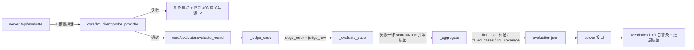

## 用户需求

用户在可视化平台「质量评估」页看到「教学专业性／教学适配度／课堂可用性／拓展性-启发性」等维度全部显示「**模型未返回该项（模型未返回合法分值）**」，追问这是什么。

经两轮澄清，用户已确认：

1. TokenHub 的 IP 白名单**已放行但仍报 403**，要求重新取证诊断；
2. 判分整体失败时期望的行为是「**两者都要**」——启动前先探活兜底（不通过不开始、不烧额度）+ 运行中失败如实呈现。

## 产品概览

本次不新增业务功能，而是修正「质量评估」在**判分调用失败**时的错误计分与误导性呈现，并让失败根因可被直接读懂、可自行诊断。

## 核心功能

- **失败绝不给分**：判分调用失败时，任何维度都不得产出分值；安全性不再因「未命中红线」默认满分，主观均分在模型零参与时显示为无数据。
- **概览如实标注**：本轮「有效评分用例数 / 判分失败用例数」分开计数；主观维度覆盖率显式给出；综合分注明其构成口径（仅由客观维度构成时明确说明）。
- **根因直通**：维度行与用例卡直接显示判分失败的根因摘要（含 HTTP 状态、供应商返回原文、供应商看到的来源 IP），取代「模型未返回合法分值」这类兜底文案。
- **启动前探活兜底**：点「开始评估」先用已存配置做一次最小校验；不通过则拒绝开始并给出可操作指引，不消耗判分额度。
- **一条命令自查**：输出当前配置（密钥脱敏）、本机对外出口地址、供应商返回原文，便于定位白名单与模型名问题。
- **模型名必填校验**：保存配置时模型名为空需明确提示，不再以占位模型名发出判分请求。

## 视觉呈现

- 概览顶部新增醒目告警条（红/黄），文案含供应商返回原文摘要与「请将该来源 IP 加入白名单」的可操作指引。
- 判分失败的用例卡在「判定失败」红标旁**直接摘出根因**，无需悬停查看。
- 无法评分的维度显示「—」，其旁灰字写明根因；无数据的主观均分显示「—」而非分数。

## 技术栈选择

沿用现有技术栈，**不新增任何第三方依赖**：

- 后端：Python 3（标准库 + `PyYAML`／`Jinja2`／`websocket-client` 已在 `requirements.txt`），HTTP 调用走 `urllib.request`（`core/llm_client.py` 既有实现）。
- 前端：`web/index.html` 单文件原生 HTML/CSS/JS，仅消费本地 REST 接口。
- 分层保持：探活与调用 → `core/llm_client.py`；评分与聚合 → `core/evaluator.py`；路由与后台任务 → `server.py`；呈现 → `web/index.html`。
- 指标定义单一事实源：`core/eval_rubric.py`（本次不改锚点与口径，仅消费其 `Dimension.basis`）。

## 取证结论（本次根因，已逐字核对）

1. 三份产物 `artifacts/rounds/{confirm_final,run_20260916_155454,run_20260916_174219}/evaluation.json` 中**每一条用例**的 `judge_error` 均为 `模型调用失败（HTTP 403）… 403005 Source IP 223.160.129.40 is not in the API Key allowlist`。
2. 该 403 与网络路径无关：本机直连出口 IP 经两个独立源（`api-ipv4.ip.sb/ip`、`ip.3322.net`）实测为 **`223.160.129.40`**，与供应商所报源 IP 完全一致；环境变量无代理，默认路由走 `en0`（无 VPN 承载），供应商域名可达。**结论：TokenHub 控制台侧白名单未真正生效，属用户侧动作，代码不能绕过。**
3. `.llm_secrets.json` 中 **`model` 为空字符串**（`base_url=https://tokenhub.tencentmaas.com/v1`）——独立缺陷：`core/llm_client.py#L404` 会静默用 `PLACEHOLDER_MODEL="gpt-3.5-turbo"` 发出判分请求。

## Implementation Approach

### 核心策略

把「判分失败」从**静默降级**改为**显式一等状态**：失败原因沿 `llm_client → evaluator（打分/聚合）→ evaluation.json → server → 前端` 全链路保真传递，并且**在任何失败路径上都不产生分值、不计入主观口径、不覆盖既有结果**。

### 关键修复点（按缺陷严重度）

1. **判分失败仍得满分（最严重）** — `core/evaluator.py#L554-560`：`safety` 在未命中红线时 `risk=""` → 直接给 5 分且标 `BASIS_HYBRID`；`_aggregate`（`#L449-455`）把 hybrid 同时计入 `obj_acc` 与 `llm_acc`，导致 `subjective_mean=1.0`。修法：判分失败（`judge_error` 非空）时 `safety` 一律 `score=None` + 根因 `na_reason`；其余 hybrid 维度同理。
2. **主观口径被污染** — 为每个分值条目新增 **`llm_used: bool`**（模型侧是否真的产出了该分值）；`_aggregate` 仅在 `llm_used` 为真时计入 `llm_acc`。这样 `subjective_mean` 在模型零参与时由 `_mean([])`（`#L428-430`）自然返回 `None`，前端按既有 `f=v=>v==null?'—':v` 呈现为「—」。
3. **计数说谎** — `#L459-460` 的 `scored_cases` 以「存在非 None 分值」为准；新增 `failed_cases`（`judge_error` 非空条数）、`llm_coverage`（应有 vs 实得的主观维度数）、`judge_errors`（去重后的根因 + 条数）。`errors[]`（`#L655-661` 仅收异常）改为同时收录判分失败。
4. **根因被兜底文案替换** — `#L532-541`、`#L564-570`：`judge_error` 非空时，`na_reason`/`reason` 直接写根因摘要；`#L602-613` 用例行新增 `judge_raw`（模型原始返回片段，脱敏 + 限长）供离线复盘。
5. **空模型名静默占位** — `core/llm_client.py#L403-408` 增加 `allow_placeholder` 参数（默认 `False`，仅 `probe_provider` 探活时传 `True`）；`_judge_case`（`#L328-331`）在 `model` 为空时直接返回「未配置模型名」错误，不再发出请求。
6. **json_mode 无降级** — `core/llm_client.py#L411-412` 无条件加 `response_format`；改为在响应 400/422 时自动去掉该字段重试一次（对判分与探活同时生效）。
7. **启动前探活** — 新增 `core/evaluator.py::preflight_check(cfg)`，复用 `probe_provider`（**有模型名走真实推理**，最能证明 Key 可用）；由 `server.py::EvalState.start()`（`#L309-327`）调用，失败返回 `(False, msg)` 并在响应中带 `probe` 结构化结果；`evaluate_round`（`#L616`）同样前置该检查，失败时**直接返回错误且不写 `evaluation.json`**（避免用空结果覆盖既有评估）。
8. **前端呈现** — `evOverview`（`#L1316-1325`）KPI 口径改写 + 零主观覆盖时插入告警条；`evCase`（`#L1367`）把根因从 `title` 提到正文；模型名必填校验。

### 性能与可靠性

- `_aggregate` 仍为单遍 `O(用例数 × 维度数)`，新增 `llm_used` 为 `O(1)` 判定，无额外遍历、无额外落盘。
- **收益量化**：当前一次失败评估会为**每条用例各发一次注定失败的判分请求**（并发 3、超时 60s、模型名无效）。前置探活把「N 次请求 + N×超时」压缩为**1 次 ≤12s 的探活**即早退，直接避免额度与时间浪费。
- `diagnose_llm.py` 外部调用限制为「最多 2 个 IP 回显 + 1 次探活」，全部短超时（≤8s / 12s），失败即降级为提示，不阻塞。

### 安全与向后兼容

- **绝不回显 API Key**：`judge_raw`、根因摘要、诊断脚本输出全部复用 `core/llm_client.py` 既有脱敏函数；`.llm_secrets.json` 保持 0600 且已在 `.gitignore`。
- 新增字段一律可选，旧 `evaluation.json` 仍可渲染（前端已用 `==null` / `??` 兜底）；`scored_cases` 语义变化只影响新产物。
- 不改任何评分锚点、阈值与分组口径，历史结果可比性不受影响。

## 架构设计（失败传播链路，本次改动集中在链路保真）



## Directory Structure

```
ruiyun-ui-test-platform/
├── core/
│   ├── evaluator.py        # [MODIFY] 判分失败一律不给分并标记 llm_used；safety/aesthetics/ratio 维度根因直通；
│   │                       #           _judge_case 空 model 早退；用例行新增 judge_raw；
│   │                       #           _aggregate 口径修正（scored_cases/failed_cases/llm_coverage/judge_errors）
│   │                       #           与 errors[] 收录判分失败；新增 preflight_check() 供 server 与 CLI 复用
│   └── llm_client.py       # [MODIFY] chat() 新增 allow_placeholder（默认 False，仅探活传 True）、
│                           #           response_format 被 400/422 拒绝时自动去字段重试一次、max_tokens 可配；
│                           #           复用既有脱敏函数以支持 judge_raw 安全落盘
├── server.py               # [MODIFY] EvalState.start() 前置探活，失败返回 409 且响应带 probe 结构化结果；
│                           #           POST /api/llm/config 保存时校验模型名非空并给出明确提示
├── web/index.html          # [MODIFY] evOverview：KPI 改为「有效评分 / 判分失败」并显式给出主观维度覆盖率，
│                           #           零主观覆盖时插入含供应商原文与白名单指引的告警条；
│                           #           evCase：根因从 title 提升为正文展示；模型设置弹窗模型名必填校验
├── scripts/
│   ├── diagnose_llm.py     # [NEW] 一条命令自查：打印脱敏配置、本机对外出口地址（多源比对）、
│   │                       #       用服务端已存配置跑一次真实探活并原样回显 403/4xx 正文与源 IP，
│   │                       #       输出「需加入白名单的 IP」与「建议填写的模型名」结论
│   └── test_eval_scoring.py# [NEW] 注入式自测（沿用 scripts/test_llm_probe.py 的 _do_request 打桩范式，
│                           #       不联网）：判分失败不得分、subjective_mean 为 None、scored_cases/failed_cases
│                           #       口径、根因直通到 na_reason、judge_raw 脱敏、前置探活拒绝启动且不写盘
├── config.yaml             # [MODIFY] llm 段新增可选 max_tokens（防 20 维长 JSON 被截断），默认留空不改行为
├── CODEBUDDY.md            # [MODIFY] 常用命令区补充 scripts/diagnose_llm.py 与 scripts/test_eval_scoring.py
└── .llm_secrets.json       # [NO-CHANGE] 0600、已 gitignore；仅由 save_config/clear_config 读写，绝不入库
```

## Key Code Structures

分值条目新增「模型侧是否真的产出」标记，作为聚合口径的唯一依据（多处依赖，需精确约定）：

```python
# core/evaluator.py — 每个 scores[key] 条目新增字段
{
    "key": str, "label": str, "group": str, "scale": str,
    "score": int | None,          # 判分失败时必须为 None
    "basis": "objective" | "llm" | "hybrid",
    "llm_used": bool,             # 模型侧是否真的产出了该分值；hybrid 判分失败时为 False
    "reason": str,                # 失败时写根因摘要，不再写「模型未返回该项」
    "na_reason": str, "evidence": dict,
}
```

概览新增字段（前端按可选消费，旧产物缺字段仍可渲染）：

```python
# core/evaluator.py::_aggregate 返回
{
  "scored_cases": int,     # 至少一个非 None 分值的用例数
  "failed_cases": int,     # judge_error 非空的用例数
  "llm_coverage": {"expected": int, "scored": int},   # 主观维度应有 / 实得
  "judge_errors": [{"reason": str, "count": int}],    # 去重后的根因摘要
}
```

## Implementation Notes

- **不回显密钥**：`judge_raw` 与诊断输出必须过 `core/llm_client.py` 既有脱敏函数并限长（约 400 字符）；`public_config()` 保持只返回 `key_hint`。
- **探活语义**：`probe_provider` 的返回需原样保留供应商返回体摘要（`detail`）与 `status`，这正是让用户看到「该把哪个 IP 加白名单」的唯一凭据；不要把 403 归并成笼统的「鉴权失败」。
- **不覆盖既有产物**：前置探活失败时不得写 `evaluation.json`；评估中途失败仍照常落盘（含失败标记），便于复盘。
- **改动半径最小化**：不改 `core/eval_rubric.py` 的锚点/尺度/分组；`format_compliance` 与 `stability` 仍在 `_LOCAL_ONLY`（`#L46`）内，不进模型请求。
- **用户侧前置动作（代码不绕过）**：把 `223.160.129.40` 加入 TokenHub 该 API Key 的 IP 白名单（注意出口 IP 可能动态变化，必要时按 CIDR 放行）；并在「模型设置」中填写正确的**模型名 / 端点 ID**（当前为空，否则即使放行也必然失败）。
- **自测口径**：本机真实 Key 的 403 未解，联调验证一律以注入式假供应商覆盖，不以 403 通过作为验收标准。

## Agent Extensions

### Skill

- **编程专家.Skill**
- Purpose: 作为本次修复的工程纪律层——用根因调试法定位「判分失败被计满分」的因果链，按阶段推进改动，并对评分口径、错误传播与安全（密钥不回显）做代码审查。
- Expected outcome: 形成可复核的根因结论与修复清单，产出的改动通过注入式自测与回归验证，且不引入新的技术债。

### SubAgent

- **code-explorer**
- Purpose: 在改动前一次性摸清 `scored_cases`／`summary`／`judge_error`／`public_config` 等被改动字段的**全部消费方**（`server.py`、`web/index.html`、`report/`、`scripts/`），避免漏改或破坏兼容。
- Expected outcome: 输出受影响调用点清单与兼容性结论，确保新增字段为可选、旧产物仍可渲染。