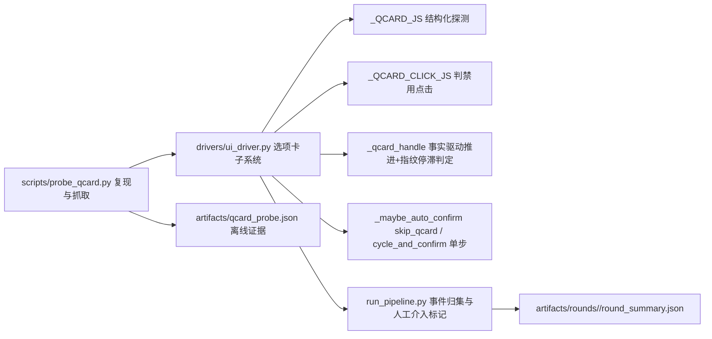

## 产品概述

修复「睿云智能工作台」UI 自动化平台中，对 agent 自行生成的选择卡片（`agent-question-composer` 选项卡）自动点击失效的问题。当前表现为：同一张选项卡被反复点击、状态不推进，直到累计点击触发熔断、转为人工介入，任务因此卡住或产出「假通过」。

## 核心功能

- **真实复现**：驱动应用投放本机富文本附件 `/Users/amano/Downloads/1尚睿通科技考勤制度V6.1.pdf`，发送「读取该文件并总结要点」，让 agent 主动弹出选择题卡片。
- **卡片状态可观测**：抓取卡片真实状态——题号（`x/y`）、选项文本、是否已选中（`is-selected`）、是否禁用（`disabled`）、底部按钮到底是「提交 / 确认」还是「跳过」，落盘为可离线核对的证据文件。
- **自动作答推进**：按「选中第一个可点选项 → 点提交/确认」推进；末题点「提交」结束卡片，非末题点「确认」进入下一题；「跳过」类按钮永不点击。
- **不假成功**：按钮处于禁用（提交中）时不得记为成功点击；点击后必须能观察到卡片状态真的推进，否则计入失败尝试。
- **不空转**：同一张卡片、同一题在无进展时不得无限重复点击；达到阈值须尽快停止自动确认并明确标记需人工介入，而不是点满上限。
- **可回归验证**：不驱动应用即可注入式自测全部新规则；并做一次真实端到端验证，确认选项卡被顺利点完、任务继续执行到真实答复。

## 视觉与交互效果

本任务不涉及界面改版；仅影响控制台 `[auto-confirm]` 日志、轮次归档 `auto_confirm_events` 与用例级 `auto_confirms` 的呈现（日志需能区分「第几题 / 点了什么 / 按钮类型 / 是否被禁用 / 为何判定无进展」）。

## 技术栈

沿用现有技术栈，**不引入任何新依赖**：

- Python（统一解释器 `/Users/amano/.workbuddy/binaries/python/envs/default/bin/python`，标准库为主）
- `websocket-client`（仅 `drivers/cdp.py` 使用）
- CDP（Chrome DevTools Protocol）DOM 级驱动，零屏幕坐标
- YAML 配置（`config.yaml`）+ 纯 `assert` 自测脚本（无 pytest）

## 实现方案

### 核心策略：从「内存状态机」改为「DOM 事实驱动」

现有实现（`drivers/ui_driver.py` L677–770）把卡片交互硬编码为「无条件点第一个选项 → 点 `composer__primary`」的两段式，并凭内存变量 `_qcard_state` 判断进度。反编译应用产物（`app.asar`）确认真实组件契约后，可见其判定条件远多于驱动假设，这才是「反复点、无推进」的根因。修复思路是：**每个轮询周期都把卡片的真实 DOM 事实取回来，再按事实决定「该点哪里 / 该等待 / 该升级」**，内存只保留「进度指纹与尝试计数」，不再承担正确性。

### 已确证的应用契约（依据 app.asar 内组件源码，非猜测）

- 容器唯一：`<section class="agent-question-composer" role="dialog">`；提交成功后整卡卸载，改渲染 `chat-user-input-summary`，**不会残留可点的旧卡片**（历史残影风险低，但仍按「取最后一个可见且未提交的 composer」定位以防万一）。
- 多题结构：`counter` 显示 `i+1/u`；选项 `button.agent-question-option`，选中态为附加类 `is-selected`。
- 单选且非末题时，**点选项会立即自动跳到下一题**（`!multi_select && !last && next()`）——同一轮内 DOM 已换成另一题，驱动的旧状态描述会失真。
- 底部按钮语义（关键）：
- 末题：`button.agent-question-composer__primary`，文案「提交」，`disabled = 提交中`。
- 非末题已作答：同 `__primary`，文案「确认」（进入下一题）。
- 非末题未作答：`button.agent-question-composer__skip`，文案「跳过」——**绝不可点**（会跳过该题）。
- 提交中：按钮禁用且文案变「提交中…」。
- 因此「`hasSubmit`」这一布尔量不足以决策，必须区分 `primary / skip / none` 三类按钮并携带 `disabled`。

### 关键设计决策

1. **探测脚本返回结构化事实**（单次 CDP 往返，避免多次 eval 造成状态错位）：

```text
{ found: bool, counter: "i/u", questionIndex: i, isLast: bool, submitting: bool,
  options: [{label, selected, disabled}],
  button: {kind: "primary"|"skip"|null, text, disabled} }
```

`submitting` 由「primary 文案含‘提交中’或按钮禁用而选项全禁用」交叉推断。

2. **点击 JS 必须判 `disabled` 并区分目标**：`if (!el || !vis(el) || el.disabled || el.getAttribute('aria-disabled')==='true') return false;`。这一条直接消除「禁用期仍记成功点击」造成的假事件洪水。
3. **DOM 事实驱动的推进规则**（替代原两段式）：

- `submitting` 为真 → 只等待，不做任何点击，并刷新「在途」计时。
- 存在可用 `primary`（且非「跳过」）→ 先确保本题已作答（有任一 `selected` 或自定义输入非空）；末题直接点提交，非末题点确认进入下一题。
- 无 `primary` 但本题未作答且有可用选项 → 点**第一个未禁用的选项**（幂等：单选重复点只是重选）。
- 永不点 `skip`、`close`(×)、`上一题/下一题` 导航键。

4. **进度指纹与停滞判定**（修掉「只要在点就永不告警」的看门狗口径缺陷）：

- 指纹 = 题目文本 + `counter` + 选项标签集合；指纹变化 = 真实推进 → 清零同签名尝试计数并刷新时间。
- 同一指纹点击次数超过上限（默认 6）或指纹超过停滞窗口（默认 30s）未变 → 立即停用自动确认、置 `confirm_human_needed`，打印明确原因（而不是点满 200 次才熔断）。
- 点击间隔节流（默认 1.0s），避免 0.5s 轮询造成同题连点。

5. **单轮单步**：`cycle_and_confirm`（L930–986）当前一轮内会调用 `_qcard_handle()` 2~3 次，导致同卡重复点击；改为「一轮最多完成一次推进」，尾部通用扫描通过新增 `skip_qcard=True` 参数跳过卡片路径，并修正 `_pin_title` 的赋值时序（在最后一次卡片交互之后计算）。
6. **向后兼容**：事件字典保留 `time/ts/mode/text/cls` 旧字段（`run_pipeline.py` L95、L440、L472 与仪表盘继续可用），仅新增 `q/kind/disabled/reason` 等字段；新增阈值一律 `app_cfg.get(..., 默认值)` 读取，`config.yaml` 不改也能跑。

### 性能与可靠性

- 每轮询仅 1 次探测 eval + 至多 1 次点击 eval，复杂度 O(选项数)，与现有轮询节拍（0.5s）一致，无额外网络/IO。
- `confirm_events` 目前无上限增长，靠 `confirm_max_clicks` 熔断兜底；新方案把「无进展重复点击」压到 ≤6 次，事件量从数百降至个位数，同时天然抑制内存增长与日志刷屏。
- 所有点击后校验「下一轮探测中卡片指纹/存在性是否推进」，杜绝「点了但没生效仍记为成功」的假通过。

## 架构设计

不新增架构模式，沿用现有分层：`scripts/` 诊断层 → `drivers/ui_driver.py` 驱动层 → `run_pipeline.py` 编排层 → `artifacts/` 归档层。改动集中在驱动层的选项卡子系统，通用两层检测（关键词 / 同父按钮组）与工具授权卡路径保持不变，将影响面限制在 `agent-question-composer` 一族。



## 目录结构

```
ruiyun-ui-test-platform/
├── drivers/
│   └── ui_driver.py                    # [MODIFY] 选项卡子系统整体重写：_QCARD_JS 改为返回最后一个可见
│                                       #   未提交 composer 的结构化事实（counter/questionIndex/isLast/submitting/
│                                       #   options[label,selected,disabled]/button[kind,text,disabled]）；
│                                       #   _QCARD_CLICK_JS 增加 disabled 与 aria-disabled 拦截、按目标类型取元素、
│                                       #   返回布尔有效性；_qcard_handle 重写为 DOM 事实驱动推进 + 进度指纹 +
│                                       #   点击节流 + 同指纹尝试上限/停滞看门狗 + 点击后推进校验，并新增
│                                       #   qcard_min_click_interval_s / same_card_limit / stall_s 三个可选配置读取；
│                                       #   _maybe_auto_confirm 新增 skip_qcard 参数；cycle_and_confirm 改为一轮
│                                       #   最多一次推进并修正 _pin_title 时序；保留旧事件字段与通用两层检测不变。
├── scripts/
│   ├── probe_qcard.py                  # [NEW] 真实复现与抓取：ensure_ready → reset_to_new_task →
│   │                                   #   attach_files(~/Downloads/1尚睿通科技考勤制度V6.1.pdf) → 发送
│   │                                   #   「读取附件并总结要点」→ 轮询导出卡片结构化事实与每次推进结果到
│   │                                   #   artifacts/qcard_probe.json；支持 --drive 用驱动自身循环跑
│   │                                   #   自动确认直至卡片消失，打印逐次 [auto-confirm] 证据；
│   │                                   #   仅在 macOS 本机运行，不关应用（结束仅 detach）。
│   └── test_cycle_confirm.py           # [MODIFY] FakeCDP 升级为返回新结构化事实，并新增断言：提交中(disabled)
│                                       #   不点击不记事件、非末题未作答不得点 skip、非末题单选自动跳题后
│                                       #   下一轮正确点新题、多题走完末题点提交、历史残留 composer 取最后一个、
│                                       #   同指纹超限即升级为需人工介入、停滞窗口触发、单轮至多一次推进。
│                                       #   保持「纯注入、不驱动应用、全部 assert 通过即 PASS」的既有风格。
├── README.md                           # [MODIFY] 「自动确认」章节更新为最新契约：多题结构、submit/confirm/skip
│                                       #   三态、提交中禁用、指纹停滞判定与新增阈值；替换已过时的
│                                       #   「两段式无条件点击」描述与实测结论。
└── config.yaml                         # [MODIFY] auto_confirm 段新增（带注释、可缺省）：
                                        #   qcard_min_click_interval_s / qcard_same_card_limit / qcard_stall_s；
                                        #   修正 confirm_max_clicks 注释中「同一选项组 120s 冷却」等旧口径说明。
```

## 执行注意

- 复现任务必须走附件路径：`attach_files()` 用 `Input.dispatchDragEvent` 投递 PDF，并以「引用计数 `(n/10)` 是否增加」判定投递成功；投递失败仍发送但写 `ui_error`，不得当成功。
- 应用当前未运行（9222 未监听），`ensure_ready()` 会按需拉起并注入 `env_profile: dev`；必须保留 `ELECTRON_RUN_AS_NODE` 清除、`--disable-gpu --no-sandbox`、代理绕过、`data:` 外壳页就绪判定。
- 不要用「日志 N 秒无变化」判卡住（`session.messages.json` 整轮结束才落盘）；复现脚本以「卡片事实是否推进」为唯一判据，超时即放弃并落盘证据。
- 卡片出现具有随机性（同一 prompt 可能直接执行），复现脚本需支持多次尝试与「重发同一任务」，每次尝试都记录是否出卡。
- 日志只打印脱敏后的题目/选项短文本（≤40 字），不打印整段对话；新增字段保持事件字典体量可控。

## Agent Extensions

### Skill

- **编程专家.Skill**
- Purpose: 用于选项卡子系统的根因修复与代码自审（根因调试、重构、可测试性、边界与失败路径审查）
- Expected outcome: `_qcard_handle` 重写后无「假成功点击 / 无进展空转 / 事件洪水」，且失败路径均能如实上报并标注需人工介入
- **pdf**
- Purpose: 解析 `/Users/amano/Downloads/1尚睿通科技考勤制度V6.1.pdf`，提炼章节/要点清单，作为端到端验证的核对基准
- Expected outcome: 产出该 PDF 的内容要点清单，用于确认 agent 在选项卡被自动点完后确实读到了文件并给出真实总结（而非卡在提问卡上的假通过）